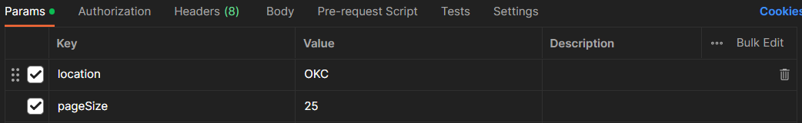

# NOTAM

This is a capstone project for OU Fall 2023 CS.

# FRONTEND

Navigate to the frontend directory and run `npm install` to grab necessary packages from packages.json, then run `npm start`

# BACKEND

Before starting the backend, do the following steps:

1. Add a "credentials.py" file to the "airport" directory with these variables and the proper values in place:

```
client_id=""
client_secret=""
```

2. Go to this link: https://adds-faa.opendata.arcgis.com/datasets/faa::airports-1/explore. Download the csv file of all the airports and move it to the "airport" directory
3. Go to the "csv_parser.py" file and paste the file path to the "Airports.csv" file in the "airport_csv_path". Make sure to replace all "\" with "/"

Airport Endpoint:

To hit the airport endpoint properly, open postman and add the following params to the parameter page:


After doing so, the airport endpoint should return all the NOTAMS for the departure/destination airports and all the lat/long points between them.
